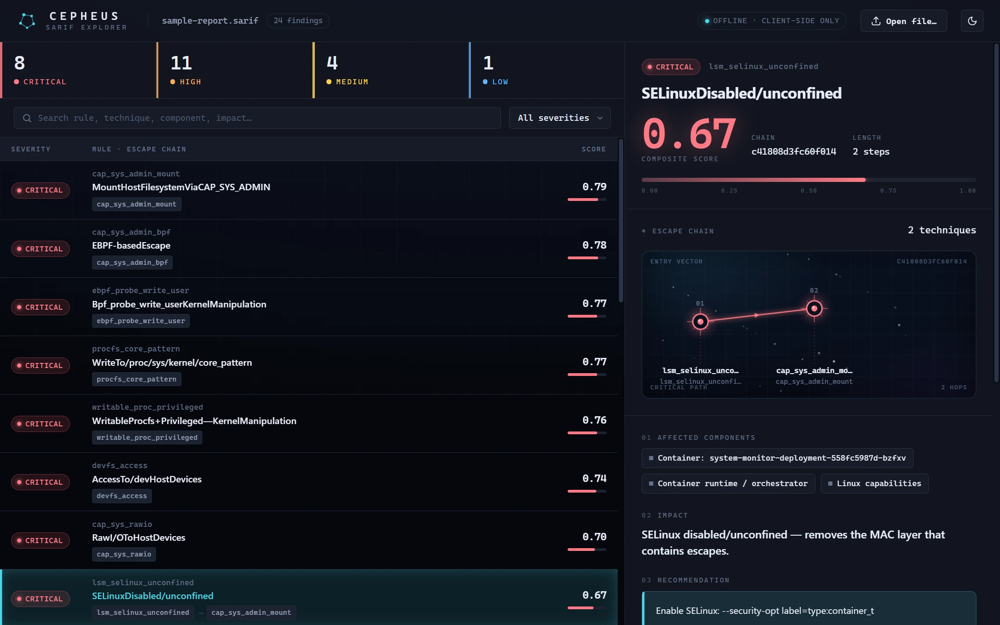
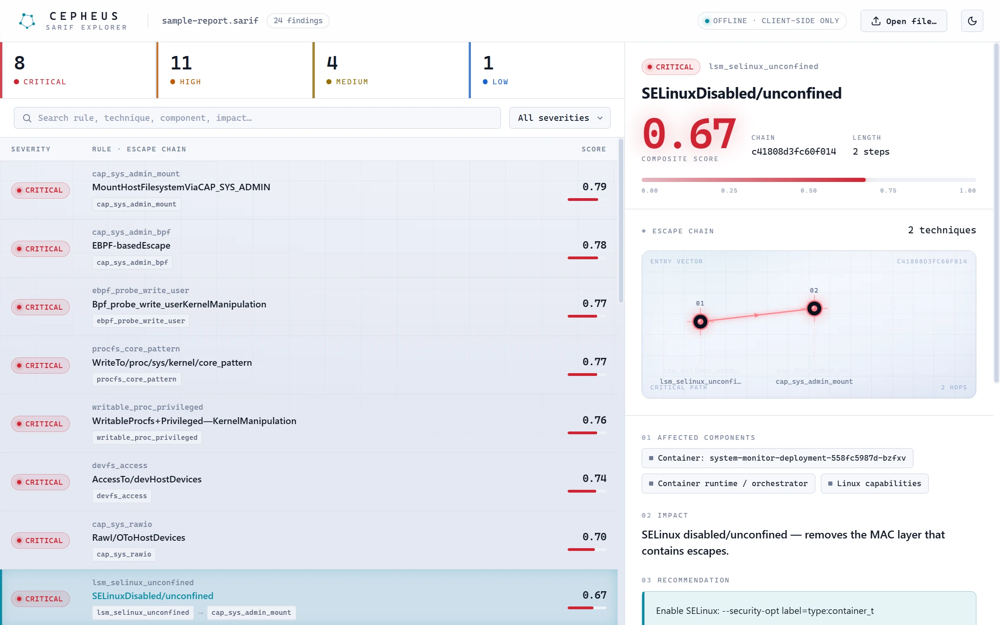

# Cepheus

Container escape scenario modeler. A POSIX shell enumerator captures a
container's security posture; a Python engine matches that posture against 65
known escape techniques, builds scored single- and multi-step attack chains,
and reports prioritized findings. It runs as a CLI, a CI gate, a Kubernetes
admission webhook, and a cluster fleet scanner, and ships an offline SARIF
viewer for the results.



## How it works

Two components, one pipeline:

1. **Enumerator** — a dependency-free POSIX shell script. It runs inside a
   container (busybox sh, dash, or bash; works
   in distroless/scratch when a shell is present) and dumps the security
   posture to JSON: capabilities, mounts and filesystem types, kernel version,
   cgroup version, seccomp mode, AppArmor/SELinux profiles, namespace
   isolation, network and cloud-metadata reachability, socket access, K8s
   service-account tokens, secret-pattern environment variables, and writable
   sensitive paths.
2. **Analysis engine** — ingests the posture, matches it against the technique
   database, builds attack chains (single-technique escapes plus natural
   two-step pairings such as info-disclosure → escalation), scores each chain
   by a composite of reliability, stealth, and confidence, and renders the
   result in the format you ask for.
3. **Live confirmation** — a static match is a *hypothesis*, not a finding.
   When a live container is available (`scan -c` or `analyze -c`), Cepheus runs
   each technique's non-destructive verifier inside it and reports **only the
   escapes it can actually confirm** by default. This is the precision-first
   default that keeps a report from becoming a wall of theoretical matches.

Chains are ranked highest-score-first. Missing posture data falls back to a
low confidence rather than dropping the technique, so a partial enumeration
still produces signal. Each chain carries a confirmation verdict —
**CONFIRMED** (the verifier demonstrated the primitive), **POTENTIAL**
(matched but not yet confirmed), or **UNVERIFIABLE** (no automated probe
exists, e.g. a kernel CVE) — so a reader never mistakes a hypothesis for a
demonstrated escape.

## Install

Pick the form that fits where you're running Cepheus. Full details in
[docs/INSTALL.md](docs/INSTALL.md).

```bash
# Container (CI-friendly, no Python required)
docker run --rm -v /var/run/docker.sock:/var/run/docker.sock \
  ghcr.io/su1ph3r/cepheus:latest ci nginx:latest --max-severity critical

# Single binary (Linux/macOS/Windows, no Python required)
curl -L -o cepheus \
  https://github.com/Su1ph3r/Cepheus/releases/latest/download/cepheus-linux-amd64
chmod +x cepheus && ./cepheus --version

# Homebrew (macOS + Linux)
brew tap su1ph3r/cepheus https://github.com/Su1ph3r/Cepheus
brew install cepheus

# Scoop (Windows)
scoop install https://raw.githubusercontent.com/Su1ph3r/Cepheus/main/scoop/cepheus.json

# pip (existing Python env) — the PyPI distribution is `cepheus-engine`;
# the bare name `cepheus` on PyPI is held by an unrelated 2018 package.
# The installed CLI is still `cepheus` and `import cepheus` still works.
pip install cepheus-engine

# Source (contributors)
git clone https://github.com/su1ph3r/Cepheus.git && cd Cepheus
pip install -e '.[dev,html,llm]'
```

## Quick start

```bash
# One shot against a live container: enumerate + analyze + live-confirm,
# reporting only the escapes Cepheus can actually demonstrate
cepheus scan --container-id mycontainer

# Capture posture from a running container, then analyze it (offline)
cepheus enumerate --container-id mycontainer -o posture.json
cepheus analyze posture.json

# Analyze a captured posture but live-confirm against the running container
cepheus analyze posture.json --container-id mycontainer

# Or enumerate an image directly (spins up an ephemeral container)
cepheus enumerate --image nginx:1.27-alpine -o posture.json

# One shot: enumerate + analyze + gate, straight from an image
cepheus ci nginx:1.27-alpine --max-severity critical
```

## Commands

| Command | Purpose |
|---------|---------|
| `scan` | Enumerate + analyze + live-confirm a running container in one shot; reports only confirmed escapes by default. |
| `analyze` | Analyze a posture JSON and report escape chains; pass `--container-id` to live-confirm. |
| `ci` | Enumerate + analyze + gate a build; emits SARIF for Code Scanning. |
| `verify` | Run non-destructive probes against a live container to confirm matched techniques. |
| `enumerate` | Capture posture JSON from a running container or an image. |
| `diff` | Compare two postures and report what changed. |
| `fleet scan` / `fleet diff` | Scan every pod in a cluster; track posture drift over time. |
| `admission-server` | Run as a Kubernetes ValidatingAdmissionWebhook. |
| `techniques` | Browse the technique database. |
| `update` | Check for (and optionally apply) a newer release. |
| `notify` | Send a one-off alert through a configured channel. |

```bash
# analyze with severity filtering and alternate output formats
cepheus analyze posture.json --min-severity high
cepheus analyze posture.json --format json   -o report.json
cepheus analyze posture.json --format sarif  -o report.sarif
cepheus analyze posture.json --format mitre  -o layer.json
cepheus analyze posture.json --format html   -o report.html

# compare before/after hardening
cepheus diff before.json after.json
cepheus diff before.json after.json --format json -o delta.json

# browse techniques
cepheus techniques --category capability
cepheus techniques --search sys_admin
cepheus techniques --severity critical
```

## Output formats

`scan`, `analyze`, `ci`, and `verify` render to terminal tables, JSON, or
SARIF 2.1.0; `analyze` and `scan` additionally emit HTML reports and MITRE
ATT&CK Navigator layers. The terminal and JSON/SARIF output carry each chain's
confirmation verdict when a live confirmation pass has run. SARIF is the
default for `ci` because GitHub Code Scanning ingests it directly.

Every SARIF finding carries the data a reviewer needs to triage it without
re-running the tool: **severity**, the **affected component(s)** (the container
plus the subsystems the chain abuses — capabilities, host mounts, kernel,
runtime), the **impact** (the consequence an attacker achieves), a
**recommendation** (including the container-runtime flag that closes the
primitive), the reliability/stealth/confidence sub-scores, and the compliance
crosswalk. The stable output contract is documented in [docs/API.md](docs/API.md).

## SARIF viewer

A self-contained, offline viewer for Cepheus SARIF reports lives in
[`web/`](web/). Open `web/index.html` in any browser and drop a report — no
server, no network, no data leaves the page. The left pane is a
severity-sorted findings table; selecting a finding shows its chain graph and
the full detail panel. Light and dark themes are included.



## CI integration

`cepheus ci` enumerates an image (or reads a pre-captured posture), analyzes
it, and exits non-zero when the gate trips. Exit codes are stable: `0` pass,
`1` gate tripped, `2` usage/IO error.

```bash
# fail the build on critical chains; upload SARIF to GitHub Code Scanning
cepheus ci my-app:${GITHUB_SHA} --max-severity critical -f sarif -o cepheus.sarif

# regression-only gate — fail only when NEW chains appear vs. a baseline
cepheus ci my-app:${GITHUB_SHA} --baseline baseline.sarif --fail-on-new -f sarif -o out.sarif
```

A dedicated GitHub Action wraps this for one-line use:

```yaml
- uses: Su1ph3r/cepheus-action@v1.1.1
  with:
    image: my-app:${{ github.sha }}
    max-severity: critical
```

The action installs `cepheus-engine`, runs `cepheus ci`, writes SARIF, and
uploads it to Code Scanning. Its source lives in [`cepheus-action/`](cepheus-action/)
and is mirrored to the standalone [`Su1ph3r/cepheus-action`](https://github.com/Su1ph3r/cepheus-action)
repo on each release. See [docs/CI.md](docs/CI.md) for the full workflow.

## Kubernetes admission webhook

`cepheus admission-server` runs as a ValidatingAdmissionWebhook: it converts
each incoming PodSpec into a synthetic posture, runs the same analysis
pipeline, and allows or denies the pod against the configured gate. It
supports per-pod policy labels (`cepheus.io/policy: enforce|warn|skip`),
optional mutual TLS so only the kube-apiserver can reach `/validate`,
fail-open vs. fail-closed behavior, optional Node kernel-version lookup for
kernel-CVE gating, and Slack / PagerDuty / generic-webhook deny notifications.

Install with the Helm chart at [`charts/cepheus-admission/`](charts/cepheus-admission/)
(cert-manager or a self-signed one-shot Job for TLS). Deployment guide:
[docs/ADMISSION.md](docs/ADMISSION.md).

## Fleet operations

```bash
# scan every running pod in the current cluster, then track drift
cepheus fleet scan -o fleet-before.json
cepheus fleet scan --namespace prod --selector "tier=backend" -o fleet-after.json
cepheus fleet diff fleet-before.json fleet-after.json --fail-on-regression
```

`fleet scan` shells out to `kubectl`, so it uses your current
kubeconfig/context unless `--kubeconfig` / `--context` override them.
`fleet diff --fail-on-regression` exits non-zero only when a pod gains chains
or raises its score, so a clean rollout doesn't break CI.

## Live verification

A static posture match reports what *could* be exploitable. Live verification
confirms it: for each matched technique with a probe, Cepheus runs a
non-destructive check inside the live container and classifies the outcome as
CONFIRMED, NOT_CONFIRMED, NO_VERIFIER, or ERROR.

The fastest path is `scan`, which folds confirmation into the default flow and
surfaces **only confirmed escapes**:

```bash
# enumerate + analyze + confirm; report only what is actually exploitable
cepheus scan --container-id mycontainer

# include unproven (potential / unverifiable) matches too
cepheus scan --container-id mycontainer --show-potential

# confirm a previously captured posture against its live container
cepheus analyze posture.json --container-id mycontainer
```

Each surviving chain is tagged **CONFIRMED**, **POTENTIAL**, or
**UNVERIFIABLE**. By default only CONFIRMED chains are shown; refuted matches
(the verifier rejected them) are dropped entirely. Some CVE probes only prove a
*precondition* (a GPU device is present, a build socket is reachable) rather
than the version-specific bug — a pass on those is reported as POTENTIAL, not
CONFIRMED, so a fully patched host is never flagged as a confirmed escape.

The lower-level `verify` command runs the probes against an existing analysis
without the confirmed-only gating:

```bash
cepheus verify --container-id mycontainer
cepheus verify --container-id mycontainer --all-critical -f sarif -o verify.sarif
```

Probes are read-only or use the open-then-close idiom that triggers the
kernel's permission check without writing. The verifier never exploits.

## Compliance crosswalk

Techniques carry CIS Kubernetes Benchmark, NIST SP 800-190, and PCI DSS v4
control references where they apply. The mappings surface in the SARIF rule
properties, the HTML report, and the web viewer. Absence of a mapping means
"not yet enumerated," never "no control applies."

## Technique coverage

75 techniques across 6 categories:

- **Capability-based** (13): SYS_ADMIN, SYS_MODULE, SYS_PTRACE, SYS_BOOT,
  SYSLOG, PERFMON, DAC_READ_SEARCH, DAC_OVERRIDE, NET_ADMIN, SYS_RAWIO, BPF
  `probe_write_user`, and more.
- **Mount-based** (18): docker.sock, podman/containerd/CRI-O sockets,
  core_pattern, modprobe, `/sys/kernel/uevent_helper`, sysrq, sysfs, host path
  mounts, cgroup fs, `/dev`, shared `/dev/shm`, `/proc/self/fd`, device-mapper,
  `/proc/sys/vm`.
- **Kernel CVE-based** (18): CVE-2022-0185, CVE-2022-0847 (DirtyPipe),
  CVE-2024-1086, CVE-2024-21626 (Leaky Vessels), CVE-2025-21756, the
  CVE-2024-23651/23652/23653 BuildKit set, and more.
- **Runtime / orchestrator** (16): K8s service account, kubelet API, etcd,
  Docker API, containerd-shim, shared host PID namespace, runc CVE-2019-5736,
  cloud metadata SSRF, NVIDIA Container Toolkit CVEs (CVE-2024-0132/0133,
  CVE-2025-23266), ingress-nginx CVE-2025-1974.
- **Combinatorial** (6): multi-prerequisite escapes plus dynamic two-step
  chain building.
- **Information disclosure** (4): env-var secrets, cloud metadata credentials,
  K8s secret mounts, Docker env inspection.

## Scoring

```
composite = (reliability × 0.40 + stealth × 0.25 + confidence × 0.35) × length_penalty
```

Multi-step chains take a per-step length penalty so a single reliable escape
outranks a longer speculative one. Sandbox runtimes (gVisor, Kata) discount
the score. All weights are configurable.

## Configuration

```bash
CEPHEUS_MIN_CONFIDENCE=0.3              # minimum confidence threshold
CEPHEUS_MAX_CHAIN_LENGTH=3              # maximum chain step count
CEPHEUS_WEIGHT_RELIABILITY=0.40        # scoring weight: reliability
CEPHEUS_WEIGHT_STEALTH=0.25            # scoring weight: stealth
CEPHEUS_WEIGHT_CONFIDENCE=0.35        # scoring weight: confidence
CEPHEUS_CHAIN_LENGTH_PENALTY=0.15      # per-step penalty
CEPHEUS_KERNEL_ONLY_MAX_CONFIDENCE=0.5 # cap on kernel-version-only matches
CEPHEUS_DISTRO_KERNEL_MAX_CONFIDENCE=0.2 # further cap on backport-maintained distro kernels
CEPHEUS_LLM_MODEL=anthropic/claude-sonnet-4-20250514
CEPHEUS_LLM_API_KEY=sk-...             # API key for LLM enrichment
```

## LLM enrichment (optional)

With the `llm` extra installed and `--llm` passed, Cepheus adds novel
combination analysis, contextual remediation, and an executive summary via
LiteLLM. It degrades gracefully: if the extra is missing or no key is
configured, the report still renders and the missing enrichment is reported
rather than failing silently.

## Documentation

- [docs/INSTALL.md](docs/INSTALL.md) — every install channel, including offline.
- [docs/CI.md](docs/CI.md) — CI integration and the GitHub Action.
- [docs/ADMISSION.md](docs/ADMISSION.md) — the Kubernetes admission webhook.
- [docs/ARCHITECTURE.md](docs/ARCHITECTURE.md) — internals.
- [docs/API.md](docs/API.md) — the stable Python API and output contracts.
- [docs/THREATMODEL.md](docs/THREATMODEL.md) — trust boundaries and audit scope.

## Testing

```bash
pip install -e '.[dev,html]'
pytest
pytest --cov=cepheus --cov-report=term
```

## License

[MIT](LICENSE)
